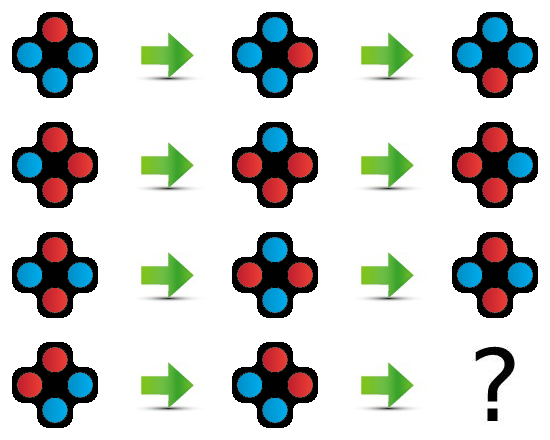

# IQ test
<p align="center">
  
  
</p>

Make a model that can get a good score in an IQ test. The test set consists of 36 sets of images each containing a logic puzzle that might involve shape, color, rotation or similar rules. Two png images are provided during evaluation: one image establishing the logic rule (see example image above to the left), and another with possible answers (above, right). The AI must be able to infer completely new rules based on 3 examples and provide an (x,y) point that points to the correct answer. All methods are allowed.  No training data is provided.


## Evaluation
You will be granted points based on how many correct answers you get, with 1 point available for a correct answer on each test/image. Your model must give an (x,y) point that is within a bounding box containing the correct answer.

Notice that you can only submit once for this use case! We encourage you to test your code and API before you submit your final model. You can find the documentation of your API where you can _try out_ images and verify the prediction. <br>
The documentation is by default found at `0.0.0.0:4242/docs`, and then find your endpoint for the use case. <br>

After evaluation, your final score will be provided. This score can be seen on the [leaderboard for this task] within 5 minutes.

Upon completion of the contest, the top 5 highest ranking teams will be asked to submit their training code and the trained models for validation. The final ranking is announced on 30/11. <br> <br>

## Getting started using Emily
Once the repository is cloned, navigate to the folder using a terminal and type:
```
emily open .
```
then select an editor of your choice to open the Emily template for use cases. A Docker container with a Python environment will be opened. Some content needs to be downloaded the first time a project is opened, this might take a bit of time. Inside the container, you can find a folder named `cases` wherein you can find the use case folder `iq-test`.

To take full advantage of Emily and the template, your code for prediction should go in `cases/wheres_waldo/ml/predictor.py`:
```
def predict(self, request):
        sample = request.image

        """
        Insert your prediction code here
        """

        x = 176  # Should be replaced with the prediction
        y = 165  # Should be replaced with the prediction

        # Leave this to ensure standardized submission format
        prediction = {'x': x, 'y': y}

        return prediction
```
For further details about the recommended structure, see <a href="https://dmiai.dk/guide/">this guide</a>.
You can add new packages to the Python environment by adding the names of the package to requirements.txt and restarting the project, or by using pip install on a terminal within the container which will result in the package being installed temporarily i.e. it is not installed if the project is restarted.

## Getting started without using Emily
To submit results you need to set up your own API. Somehow idk.
Your API should be set up to return the coordinates with format like:
```
{'x': x, 'y': y}
```

## Testing the connection to the API
See <a href="https://dmiai.dk/guide/">this guide</a> for details on how to test your setup before final submission.

## Submission
When you are ready for submission, <a href="https://dmiai.dk/guide/deploy">click here</a> for instructions on how to deploy. Then, head over to the official <a href="https://dmiai.dk/">DM i AI website</a> and submit your model by providing the host address for your API and your UUID obtained during sign up. Make sure that you have tested your connection to the API before you submit!
