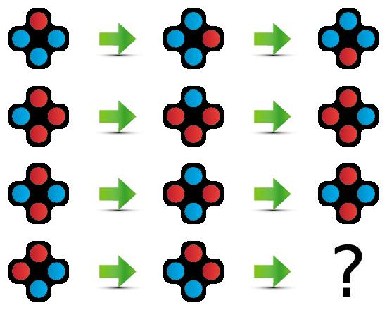

# IQ Test Solver
<p align="center">
  
  
  
  
  
</p>

Make a model that can get a good score on an IQ test. The test set consists of 36 sets of images each containing a logic puzzle that might involve shape, color, rotation or similar rules. Five images are provided during evaluation: one image establishing the logic rule (see example image above to the left), and a list of 4 images with possible answers (above, right). The "test" image has dimensions 550x440px, created by combining tiles of size 110x110px. The images with possible answers are all 110x110px. The AI must be able to infer completely new logic rules based on the 3 examples in the test image and provide the index of the correct answer from the list of choices within 10 seconds. All methods are allowed.  No training data is provided.


## Evaluation
During the week of the competition, you will be able to test your model against a test set of iq tests. The best score your model achieves on the test set will be displayed on the scoreboard.

You will be granted points based on how many correct answers you get, with 1 point available for a correct answer on each test/image. Your model must return the index containing the correct answer in the list of choices. It has 10 seconds to return the answer.

Notice that you can only submit once! We encourage you to test your code and API before you submit your final model. You can find the documentation of your API where you can try out your model and verify the prediction. <br>
The documentation is by default found at `0.0.0.0:4242/docs`, and then find your endpoint for the use case.

After evaluation, your final score will be provided. This score can be seen on the <a href="https://amboltio.github.io/DM-i-AI-client/#/leaderboard">leaderboard</a> within a few minutes.
<br> <br>

## Getting started using Emily
Once the repository is cloned, navigate to the folder using a terminal and type:
```
emily open iq-test
```
You'll be prompted for selecting an application, and you can select your preferred deep learning framework. Afterwards, you will be asked to mount a data folder for your project. This folder should include your data, for the first run it can be empty and you can add images later.
Then select an editor of your choice to open the Emily template for the use case. A Docker container with a Python environment will be opened. Some content needs to be downloaded the first time a project is opened, this might take a bit of time.

To take full advantage of Emily and the template, your code for prediction should go in `api.py`:
```
@app.post('/api/predict', response_model=PredictResponse)
def predict(request: PredictRequest) -> PredictResponse:

    # You receive image in base64 encoding.
    image = request.image_base64
    choices = request.image_choices_base64
    
    # Dummy prediction - chooses a random image from the list of choices
    next_image_index = random.choice([index for index in range(len(choices))])

    return PredictResponse(
        next_image_index=next_image_index
    )
```
For further details about the recommended structure, see <a href="https://amboltio.github.io/emily-intro/emily-intro/">this guide</a>.
You can add new packages to the Python environment by adding the names of the packages to requirements.txt and restarting the project, or by using pip install on a terminal within the container which will result in the package being installed temporarily i.e. it is not installed if the project is restarted. <br>
In case you need additional debian packages inside your container, for instance, Git, CMAKE, gcc or similar, check <a href="https://github.com/amboltio/emily-cli/wiki/How-to-add-Debian-packages-to-your-project">this guide</a> for installing extra packages.


## Testing the connection to the API
See <a href="https://amboltio.github.io/emily-intro/deploy/test/">this guide</a> for details on how to test your setup before final submission.

## Submission
When you are ready for submission, <a href="https://amboltio.github.io/emily-intro/deploy/">click here</a> for instructions on how to deploy. Then, head over to the <a href="https://amboltio.github.io/DM-i-AI-client/#/submit">Submission Form</a> and submit your model by providing the host address for your API and your UUID obtained during sign up. Make sure that you have tested your connection to the API before you submit!<br>
