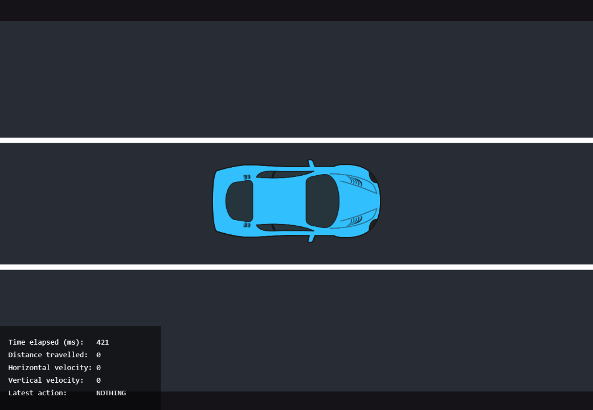
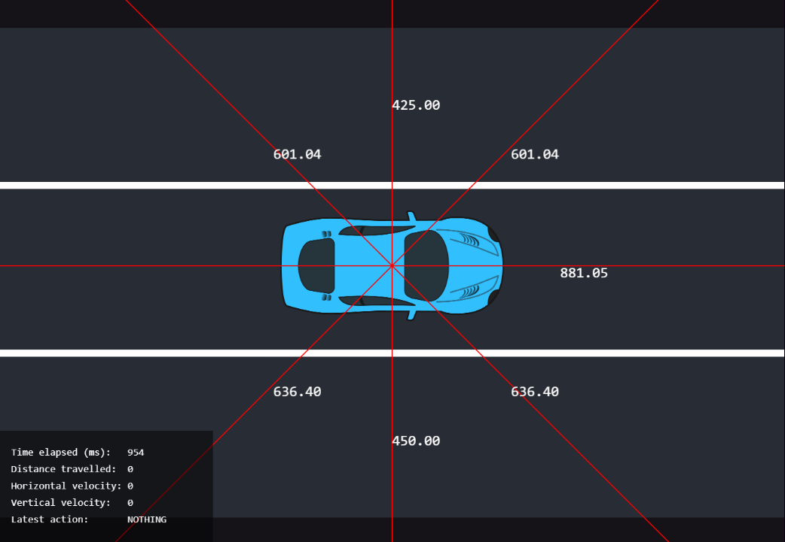

# Racing Track Simulation
In this use case, you should implement a model, that can control a car on a highway to avoid obstacles and drive as far as possible within 5000-time steps. You'll receive sensory information from the car and you should predict the next action to perform. An illustration of the game can be seen in the image below:

 

## Quickstart

1. Clone the repository and open it with Emily
    ```
    git clone https://github.com/amboltio/DM-i-AI.git
    emily open racing-game
    ```
2. Once your editor has opened, open a new terminal and run
    ```
    python api.py
    ```
3. Visit https://api.dmiai.dk/racing-game
4. Register your microservice @ `http://localhost:4242/api/predict`
5. Press the `HEALTH CHECK` button
6. Press the `START` button

Your microservice is now taking requests from the game engine.

# Documentation
You get the following information in every time step, these are specified in `dtos/requests.py`:
```
elapsed_time_ms: int
distance: int
sensors.left_side: int
sensors.left_front: int
sensors.front: int
sensors.right_front: int
sensors.right_side: int
sensors.right_back: int
sensors.back: int
sensors.left_back: int
velocity.x: int
velocity.y: int
did_crash: bool
```
The car velocity describes the speed of the car in either horizontal or vertical direction and the sensor readings state how close other obstacles are to the car from either right, left, front or back of the car. In the image above, you can see a visual explanation of the sensory data. The `did_crash` variable is a boolean telling if the car crashed or not. Following actions can be performed `ACCELERATE`, `STEER_RIGHT`, `STEER_LEFT`, `DECELERATE` or `NOTHING` as a response to the sensory information.

## Evaluation
You'll be rewarded based on how far your model drives your car without crashing into obstacles. We will run the game for a fixed amount of game ticks and based on how far and how long your car survive, you will be granted points.

Notice that you can only submit once! We encourage you to test your code and API before you submit your final model. You can find the documentation of your API where you can try out your model and verify the prediction. <br>
The documentation is by default found at `0.0.0.0:4242/docs`, and then find the prediction endpoint for the use case. 

After evaluation, your final score will be provided. This score can be seen on the <a href="https://amboltio.github.io/DM-i-AI-client/#/leaderboard">leaderboard</a> within a few minutes.

## Getting started using Emily
Once the repository is cloned, navigate to the folder using a terminal and type:
```
emily open racing-game
```
You'll be prompted for selecting an application, and you can select your preferred deep learning framework. Afterwards, you will be asked to mount a data folder for your project. This folder should include your data, for the first run it can be empty and you can add data later.
Then select an editor of your choice to open the Emily template for the use case.  A Docker container with a Python environment will be opened. Some content needs to be downloaded the first time a project is opened, this might take a bit of time.

To take full advantage of Emily and the template, your code for prediction should go in `api.py`:

```
@app.post('/api/predict', response_model=PredictResponse)
def predict(request: PredictRequest) -> PredictResponse:

    # You receive the entire game state in the request object.
    # Read the game state and decide what to do in the next game tick.

    if request.did_crash:
        logger.info(f'Crashed after {request.elapsed_time_ms} ms')

    actions = [ActionType.ACCELERATE, ActionType.DECELERATE,
               ActionType.STEER_LEFT, ActionType.STEER_RIGHT,
               ActionType.NOTHING]

    return PredictResponse(
        action=random.choice(actions)
    )
```
For further details about the recommended structure, see <a href="https://amboltio.github.io/emily-intro/emily-intro/">this guide</a>.
You can add new packages to the Python environment by adding the names of the packages to requirements.txt and restarting the project, or by using pip install on a terminal within the container which will result in the package being installed temporarily i.e. it is not installed if the project is restarted. <br>
In case you need additional debian packages inside your container, for instance, Git, CMAKE, gcc or similar, check <a href="https://github.com/amboltio/emily-cli/wiki/How-to-add-Debian-packages-to-your-project">this guide</a> for installing extra packages.

## Testing the connection to the API
See <a href="https://amboltio.github.io/emily-intro/deploy/test/">this guide</a> for details on how to test your setup before final submission.

## Submission
When you are ready for submission, <a href="https://amboltio.github.io/emily-intro/deploy/">click here</a> for instructions on how to deploy. Then, head over to the <a href="https://amboltio.github.io/DM-i-AI-client/#/submit">Submission Form</a> and submit your model by providing the host address for your API and your UUID obtained during sign up. Make sure that you have tested your connection to the API before you submit!<br>
